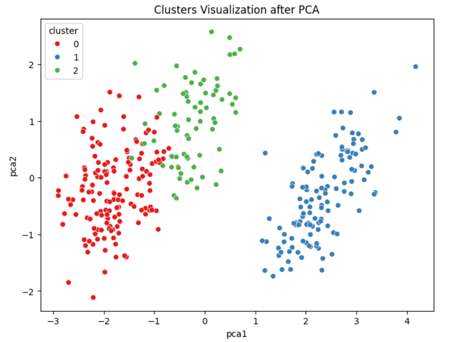
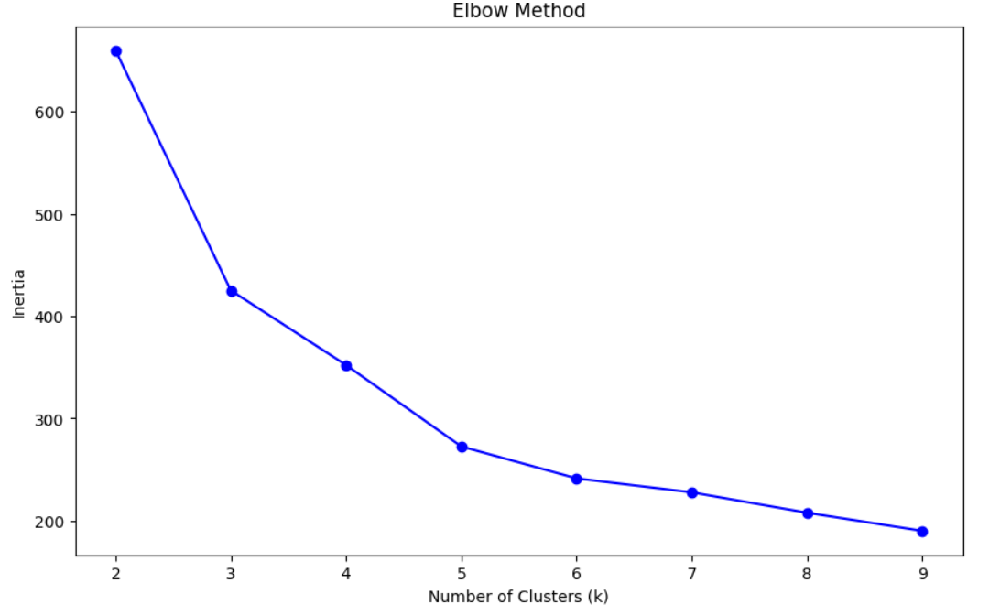

# Palmer Penguins Species Clustering

## Objective
To apply unsupervised learning techniques to cluster penguins based on physical characteristics and evaluate how closely clusters align with biological species.

## Techniques Used
- Data Cleaning & Imputation
- Feature Engineering (bill_ratio)
- Standardization
- K-Means Clustering
- Silhouette Score
- Elbow Method
- PCA for Visualization

## Feature Engineering
A new feature `bill_ratio` was created to represent beak shape. Silhouette Score improved after inclusion, indicating improved cluster separability.

## Model Selection
Although k=2 yielded the highest silhouette score, k=3 was selected to align with known biological species, ensuring interpretability and domain consistency.

## Validation
- Silhouette Score
- Cluster vs Species Crosstab
- PCA Visualization

## Cluster Visualization

## Elbow Method

## Model Evaluation

- Silhouette Score (k=3): 0.48  (example – use your real value)
- Silhouette Score without engineered feature: 0.41
- Silhouette Score with engineered feature: 0.48
- Adjusted Rand Index (if calculated): 0.72

The engineered feature improved cluster separation, demonstrating meaningful contribution to model performance.

## Why This Matters

Unsupervised learning can approximate biological classification without prior labels. This demonstrates how clustering can reveal natural structure in data and validate domain knowledge.

## Skills Demonstrated

- Feature Engineering
- Unsupervised Learning
- Model Validation
- Dimensionality Reduction
- Data Visualization
- Analytical Reasoning
